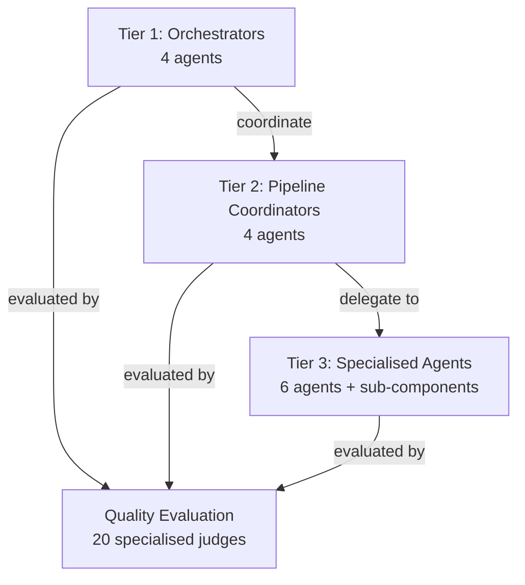
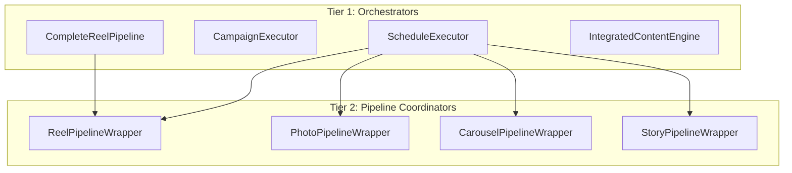
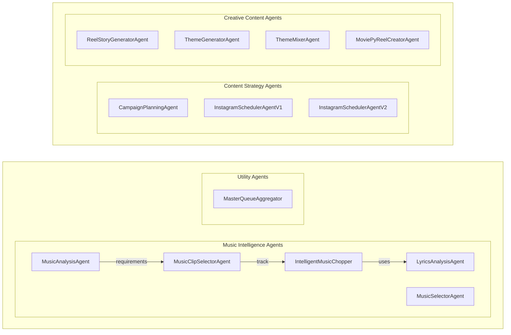
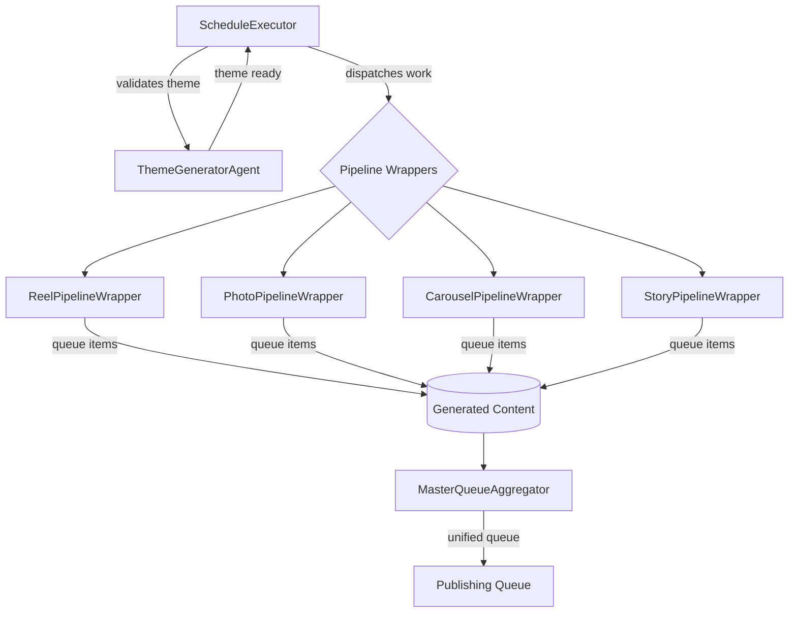
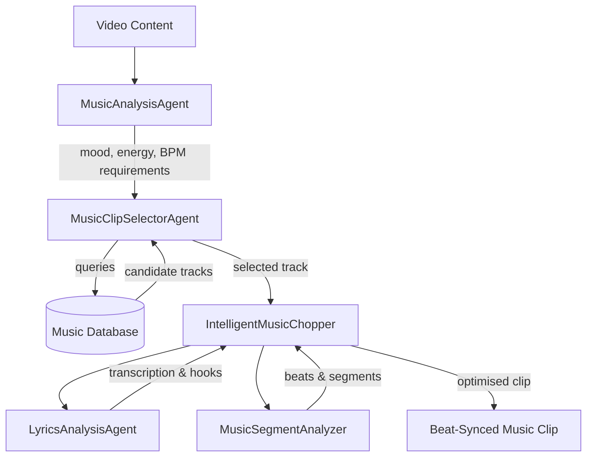
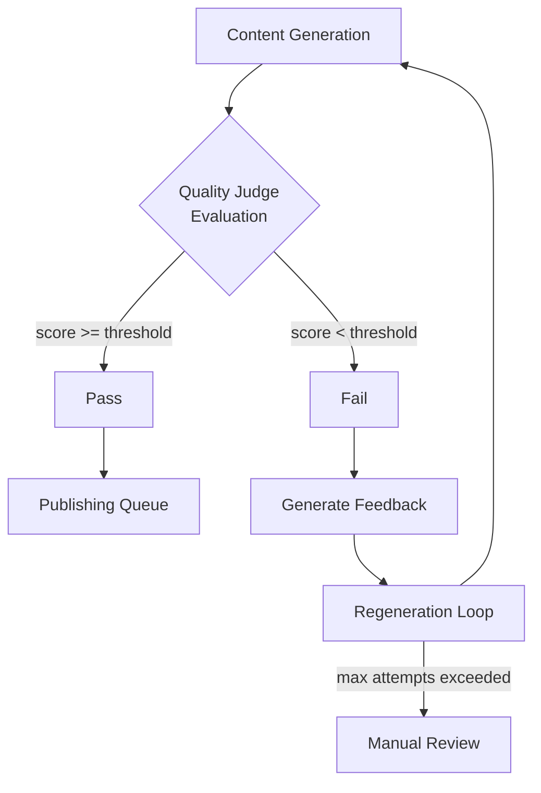

# AI Agent Architecture

This document describes the multi-agent system powering an automated Instagram content creation pipeline. The system uses a hierarchical architecture where high-level orchestrators coordinate specialised agents to handle everything from content ideation to publication.

---

## Architecture Overview

The agent system follows a **3-tier hierarchical design**:

**Total Agents: 14 primary + 20 specialised sub-components**

### High-Level Architecture

### Orchestrator Relationships

### Specialised Agent Groups

---

## Tier 1: Top-Level Orchestrators

### ScheduleExecutor

The master automation loop that drives the entire content generation pipeline. Reads pending items from the database, dispatches work to appropriate pipeline wrappers, and aggregates results into a unified publishing queue.

**Responsibilities:**
- Monitors database for scheduled content items
- Validates themes before execution using ThemeGeneratorAgent
- Routes content requests to appropriate pipeline wrappers (Reel, Photo, Carousel, Story)
- Tracks execution status and handles errors
- Aggregates all generated content via MasterQueueAggregator

**Sub-agents orchestrated:**
- ThemeGeneratorAgent
- ReelPipelineWrapper
- PhotoPipelineWrapper
- CarouselPipelineWrapper
- StoryPipelineWrapper
- MasterQueueAggregator

---

### CampaignExecutor

Bridges campaign strategy and content execution. Takes high-level campaign plans and enriches schedule items with campaign context, ensuring content cohesion across multi-post campaigns.

**Responsibilities:**
- Loads campaign strategies from CampaignPlanningAgent
- Enriches individual schedule items with campaign context
- Maintains thematic consistency across campaign posts
- Tracks campaign progress and completion

**Sub-agents orchestrated:**
- CampaignPlanningAgent

---

### CompleteReelPipeline

End-to-end orchestrator for Instagram Reel generation. Manages the full workflow from video concept to publishable reel with captions, hashtags, and music.

**Responsibilities:**
- Coordinates video generation with quality validation
- Integrates music selection and synchronization
- Generates captions and hashtags for videos
- Manages quality gates before output
- Creates publishing queue entries

**Sub-agents orchestrated:**
- VideoCaptionGenerator
- VideoHashtagGenerator
- MusicAnalysisAgent
- MoviePyReelCreatorAgent
- MusicClipSelectorAgent
- ReelQualityGate
- ReelScheduler

---

### IntegratedContentEngine

Master evaluation engine that correlates multiple quality judges to provide comprehensive content assessment. Uses weighted scoring based on learned performance patterns.

**Responsibilities:**
- Coordinates multiple specialised judges
- Extracts visual features for analysis
- Correlates hashtag, caption, and visual quality
- Applies learned weights from performance data
- Provides unified quality scores

**Sub-components orchestrated:**
- VisualFeatureExtractor
- VisualHashtagJudge
- CaptionJudge
- CaptionJudgeVision

---

## Tier 2: Pipeline Coordinators

### ReelPipelineWrapper

Coordinates the reel generation workflow, from AI-powered concept generation through story creation, music selection, and final video rendering.

**Responsibilities:**
- Generates video concepts using AI
- Creates story-driven prompt sequences
- Selects and synchronizes music
- Renders final video with MoviePy

**Sub-agents used:**
- VideoCreationAgent
- ReelStoryGeneratorAgent
- MusicClipSelectorAgent
- MoviePyReelCreatorAgent

---

### PhotoPipelineWrapper

Manages single-image generation with quality thresholds and style consistency. Supports multiple generation styles for consistent aesthetics.

**Responsibilities:**
- Generates images from themed prompts
- Applies quality threshold validation
- Maintains style consistency across batches
- Handles regeneration on quality failures

---

### CarouselPipelineWrapper

Coordinates multi-slide carousel generation, ensuring visual coherence across slides while maintaining narrative flow.

**Responsibilities:**
- Generates multiple coordinated images
- Ensures visual consistency across slides
- Applies carousel-specific quality gates
- Manages slide ordering and transitions

---

### StoryPipelineWrapper

Handles Instagram Story generation with format-specific optimisations for vertical content and ephemeral engagement patterns.

**Responsibilities:**
- Generates story-optimized content
- Applies story-specific formatting
- Handles interactive elements
- Manages story sequencing

---

## Tier 3: Specialized Agents

### Content Strategy Agents

#### CampaignPlanningAgent

AI-powered creative director that designs multi-post campaigns with diverse, complementary themes while maintaining consistency to the brand theme and aesthetic.

**Capabilities:**
- Theme diversity scoring to prevent repetition
- Brand consistency validation
- Weekly content calendar generation
- Campaign storyline and arc creation
- Post idea generation with rationale

**Output:** Campaign strategies with PostIdea and ThemeProfile configurations

---

#### InstagramSchedulerAgentV1

Intelligent scheduler that orchestrates content generation across multiple pipelines based on optimal posting patterns and content mix.

**Capabilities:**
- Schedule intelligence based on engagement patterns
- Content mix optimisation (reels vs photos vs carousels)
- Theme coordination across content types
- Database-driven learning from post performance

---

#### InstagramSchedulerAgentV2

User-controlled strategy scheduler with interactive menu for manual oversight of content planning.

**Capabilities:**
- Interactive menu for content mix selection
- Instagram growth target input
- Theme preference configuration
- Multiple account support

---

### Creative Content Agents

#### ReelStoryGeneratorAgent

Creative director AI that generates complete story-driven prompt sequences for Instagram Reels. Uses 7 intelligent modules to create cohesive, engaging video narratives.

**Intelligent Modules:**
1. **Narrative Arc Builder** - Structures story progression
2. **Template-Aware Prompt Creator** - Adapts to video templates
3. **Visual Coherence Checker** - Ensures visual consistency
4. **Music Sync Optimizer** - Aligns content with music beats
5. **Anti-Repetition Filter** - Prevents content repetition
6. **Subject Variation Engine** - Diversifies subjects and angles
7. **Cinematic Language Enhancer** - Elevates visual language

**Output:** Sequenced prompt arrays with timing and transition data

---

#### ThemeGeneratorAgent

Generates comprehensive YAML theme configurations for hyperrealistic photography prompts with smart existence checking.

**Capabilities:**
- Smart existence checking (only generates missing themes)
- Theme enhancement for existing configurations
- Validation using existing theme validators
- Auto-approval for quality themes
- YAML configuration output

**Output:** Complete theme YAML files with prompt templates, style guides, and quality criteria

---

#### ThemeMixerAgent

Intelligently combines multiple photography themes with configurable mix ratios and style blending.

**Capabilities:**
- Theme mixing with ratio control
- Style compatibility analysis
- YAML configuration generation
- Cross-theme element blending

**Output:** MixedThemeConfig with blended prompt templates

---

#### MoviePyReelCreatorAgent

Video rendering agent that creates enhanced Instagram Reels using MoviePy with beat-synced transitions and professional effects.

**Capabilities:**
- Template-based video creation
- Beat-synced transitions
- Text overlay generation
- Music synchronization
- Multiple output format support

**Output:** Rendered video files with synchronized audio

---

### Music Intelligence Agents

#### MusicAnalysisAgent

Analyzes video content to determine appropriate music characteristics based on theme, mood, energy level, and campaign consistency.

**Capabilities:**
- Video mood analysis using visual cues
- Music requirement generation (BPM, energy, genre)
- Campaign consistency checking
- Instagram-optimized metadata generation

**Output:** MusicRecommendation dataclass with selection criteria

---

#### MusicClipSelectorAgent

Database-driven music selection that matches clips to video requirements using quality scoring and multi-factor matching.

**Capabilities:**
- Database-driven selection from music library
- Quality scoring based on multiple factors
- Requirement matching (BPM, mood, duration)
- Lyric similarity analysis
- Fallback selection strategies

**Output:** Selected music clips with metadata and timing

---

#### MusicSelectorAgent

Selects music tracks for multi-reel videos based on template style, energy requirements, and duration compatibility.

**Capabilities:**
- Music library scanning and indexing
- BPM matching for template sync
- Duration compatibility checking
- Fallback metadata generation
- Multi-reel coordination

**Output:** Music track selections with sync points

---

#### LyricsAnalysisAgent

Transcribes and analyses lyrical content for quality scoring using OpenAI Whisper for accurate transcription.

**Capabilities:**
- Audio transcription with Whisper
- Lyrical content analysis
- Hook and chorus detection
- Sentiment analysis
- Quality scoring for vocal content

**Output:** Transcription with annotated sections and quality scores

---

#### IntelligentMusicChopper

Combines lyrics and music analysis to create high-quality clips optimized for reels with multiple duration options.

**Capabilities:**
- Combines LyricsAnalysisAgent and MusicSegmentAnalyzer
- Quality threshold enforcement
- Multi-duration clip generation (15s, 30s, 60s)
- Beat-aligned cutting
- Vocal highlight detection

**Sub-agents used:**
- LyricsAnalysisAgent
- MusicSegmentAnalyzer (utility)

**Output:** Optimized music clips with quality metadata

---

### Utility Agents

#### MasterQueueAggregator

Aggregates outputs from all content pipelines into a unified publishing queue with multi-format export capabilities.

**Capabilities:**
- Loads queues from all pipeline types
- Normalizes to unified QueueItem format
- Exports to JSON, TXT, Google Sheets
- Handles account separation
- Date filtering and sorting

**Output:** Unified queue files for publishing system

---

## Quality Evaluation Sub-Components

The system includes specialised judges for different content types:

### Photo Evaluation
- **BrandPhotoJudge** - Brand-specific photo evaluation
- **ComprehensivePhotoAnalyzer** - Detailed multi-factor analysis
- **AdaptivePhotoJudgeSystem** - Learning-based assessment
- **SelfLearningPhotoJudge** - Feedback-loop improvement
- **PhotoQualityAnalyzer** - Prompt-quality correlation
- **PhotoPatternAnalyzer** - Pattern recognition

### Caption Evaluation
- **CaptionJudge** - Text-based style evaluation
- **CaptionJudgeVision** - Vision-based accuracy checking
- **CaptionStyleAnalyzer** - Style profiling

### Hashtag Evaluation
- **HashtagJudge** - Basic hashtag scoring
- **VisualHashtagJudge** - Visual-aware evaluation
- **CarouselHashtagAnalyzer** - Carousel-specific analysis
- **HashtagAnalyzer** - Pattern analysis

### Video Evaluation
- **BrandVideoJudge** - Brand-specific video evaluation
- **VideoQualityEvaluator** - Technical metrics
- **VideoPromptJudge** - Prompt quality assessment
- **ReelQualityGate** - Publication gatekeeping

### Carousel Evaluation
- **CarouselJudgeVision** - Vision-based evaluation
- **SelfLearningCarouselJudge** - Learning-based assessment
- **CarouselPatternAnalyzer** - Pattern recognition

---

## Agent Communication Patterns

### Pattern 1: Hierarchical Orchestration

### Pattern 2: Music Selection Chain

### Pattern 3: Quality Gate Pipeline

---

## Technology Stack

- **Language:** Python 3.13
- **AI Models:** OpenAI GPT-4, Whisper
- **Video Processing:** MoviePy
- **Database:** SQLite (account-separated)
- **APIs:** Instagram Graph API, Replicate, Google Drive
- **Configuration:** YAML theme files

---

## Key Design Principles

1. **Separation of Concerns** - Each agent has a single, well-defined responsibility
2. **Hierarchical Coordination** - Top-level orchestrators manage complexity
3. **Quality Gates** - Multiple evaluation checkpoints before publication
4. **Learning Loops** - Performance data feeds back into agent decisions
5. **Account Isolation** - Complete data separation between brand accounts
6. **Graceful Degradation** - Fallback strategies when primary methods fail
