# AI-Powered Social Media Content Pipeline

> **System Status Note:**
> This documentation describes the complete architecture of a self-improving AI content pipeline. The system is **production-capable** and was developed as a comprehensive case study in end-to-end AI automation.
>
> **Note on Social Media Integration:** While the publishing pipeline is fully functional and tested, the author does not maintain active social media accounts. Social media publishing was selected as an ideal use case because it demonstrates the full complexity of AI-powered content workflows: generation, multi-stage quality assessment, scheduling, and feedback loops. The architecture is production-ready but operates primarily as a demonstration of these capabilities.
>
> **Fully Operational:**
> - End-to-end content generation (images, videos, captions, hashtags)
> - Multi-stage quality assessment with AI judges
> - Queue management and publishing workflow
> - Complete database architecture and error handling
> - Music selection and analysis (mood matching, BPM detection, beat-sync via librosa)
> - Hashtag generation using 5-slot organic framework with visual context awareness
>
> **Modified for GDPR Compliance:**
> - **Performance tracking loop:** Platform analytics collection is currently paused due to GDPR considerations. The continuous learning system operates using **manual training data** in place of automated social media metrics. All feedback loops remain functional with human-curated quality assessments.
>
> **Under Active Development:**
> - Post-generation video analysis for improved hashtag relevance
> - Video quality assessment refinement

---

## Document Purpose
This document provides comprehensive Mermaid flowchart specifications for an AI-powered social media content creation and publishing pipeline. Each section includes visual flowcharts with brief technical explanations demonstrating end-to-end automation from concept to publication.

---

## Table of Contents
1. [System Overview](#1-system-overview)
2. [Prompt Generation & Evaluation Pipeline](#2-prompt-generation--evaluation-pipeline)
3. [Image Generation Pipeline](#3-image-generation-pipeline)
4. [Video Generation Pipeline](#4-video-generation-pipeline)
5. [Quality Assessment System](#5-quality-assessment-system)
6. [Text Generation System](#6-text-generation-system)
7. [Queue Management & Publishing](#7-queue-management--publishing)
8. [Performance Tracking & Learning Loop](#8-performance-tracking--learning-loop)
9. [Google Sheets Integration](#9-google-sheets-integration)
10. [Slack Notifications](#10-slack-notifications)
11. [API & Tool Reference](#11-api--tool-reference)
12. [Database Schemas](#12-database-schemas)
13. [Error Handling & Retry Logic](#13-error-handling--retry-logic)

---

## 1. SYSTEM OVERVIEW

### 1.1 High-Level Pipeline Flow

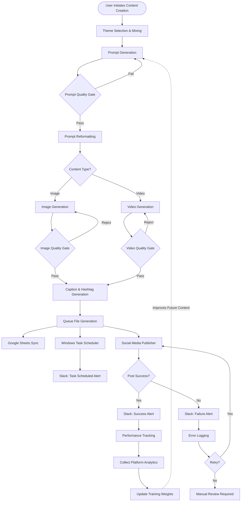

**System:** End-to-end AI content pipeline with continuous learning from real engagement metrics.

**Entry Point:** `main.py`

**Databases:** `content_pipeline.db` | `video_pipeline.db` | `photo_learning_db` | `<database_folder>/account_a.db` | `<database_folder>/account_b.db`

**APIs:** OpenAI GPT-4/4o | Image Generation | Video Generation | Platform Publishing | Analytics | Google Drive/Sheets

---

## 2. PROMPT GENERATION & EVALUATION PIPELINE

### 2.1 Theme Selection & Prompt Pipeline

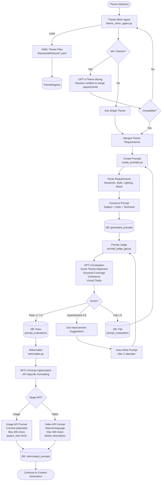

**Implementation:**
- `<evaluation_module>/theme_mixer_agent.py` - AI theme mixing (GPT-4)
- `src/prompt_generation/create_prompts.py` - Prompt construction
- `<evaluation_module>/prompt_judge_gpt.py` - Quality Gate 1
- `<evaluation_module>/reformatter.py` - API-specific formatting

**Quality Gate 1:** Pass: >= 7.0/10 | Auto-refine: 5.0-6.9 (max 2 attempts) | Reject: < 5.0

---

## 3. IMAGE GENERATION PIPELINE

### 3.1 Image Generation & Storage

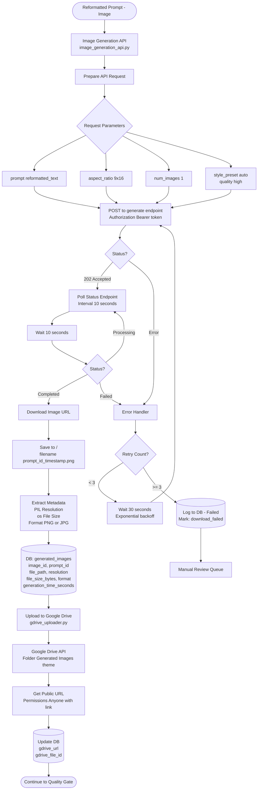

**Implementation:**
- `src/image_generation/image_generation_api.py` - Single image generation
- `src/image_generation/mass_filler_pic_gen.py` - Bulk batch processing
- `src/image_generation/gdrive_uploader.py` - Google Drive storage

**Technical Specs:**
- Polling: 10s intervals, 5min max timeout
- Retry: Exponential backoff (30s, 60s, 120s), max 3 attempts
- Validation: Rejects files < 1KB (corruption detection)
- Storage: `<image_generation_output>/` → Google Drive (public URLs)

**Current API:** Replicate FLUX.1 Krea [dev]

---

## 4. VIDEO GENERATION PIPELINE

### 4.1a Video Generation Flow

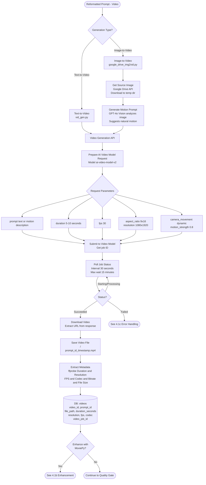

---

### 4.1b MoviePy Enhancement Pipeline

```mermaid
graph TB
    EnhanceStart([Video Ready for Enhancement])

    EnhanceStart --> MoviePyAgent[MoviePy Reel Creator<br/>moviepy_reel_creator_agent.py]

    MoviePyAgent --> MusicSelect[Music Selection<br/>music_selector_agent.py<br/>Match mood to library]
    MusicSelect --> MusicAnalysis[Music Analysis<br/>music_analysis_agent.py<br/>Detect beats & BPM]

    MusicAnalysis --> BeatDetection[Beat Detection<br/>librosa tempo and beat_frames<br/>RMS energy levels<br/>Segment intro verse chorus]
    BeatDetection --> SaveMusicMeta[(DB: music_metadata<br/>music_id, video_id<br/>bpm, beat_timestamps<br/>energy_levels, mood)]

    SaveMusicMeta --> SyncTransitions[Beat-Synced Transitions<br/>Align effects to beat timestamps<br/>Types: fade, zoom, slide]
    SyncTransitions --> AddTextOverlay[Add Text Overlays<br/>GPT-4o suggests moments<br/>2-3 short phrases 2-5 words<br/>Sync to beats]
    AddTextOverlay --> MixAudio[Mix Audio<br/>Music: 100%<br/>Original audio: 20% if exists]

    MixAudio --> PlatformFormat[Platform Content Formatting<br/>9:16 aspect ratio<br/>30 fps, H.264 codec<br/>AAC audio, 128k bitrate<br/>CRF: 23]

    PlatformFormat --> ExportEnhanced[Export Enhanced Reel<br/><enhanced_video_output>/<br/>video_id_enhanced.mp4]
    ExportEnhanced --> UpdateVidDB[(Update DB:<br/>has_music: true<br/>music_id<br/>has_text_overlays: true<br/>enhanced: true)]
    UpdateVidDB --> QualityGateVid([Continue to Quality Gate])
```

---

### 4.1c Video Error Handling

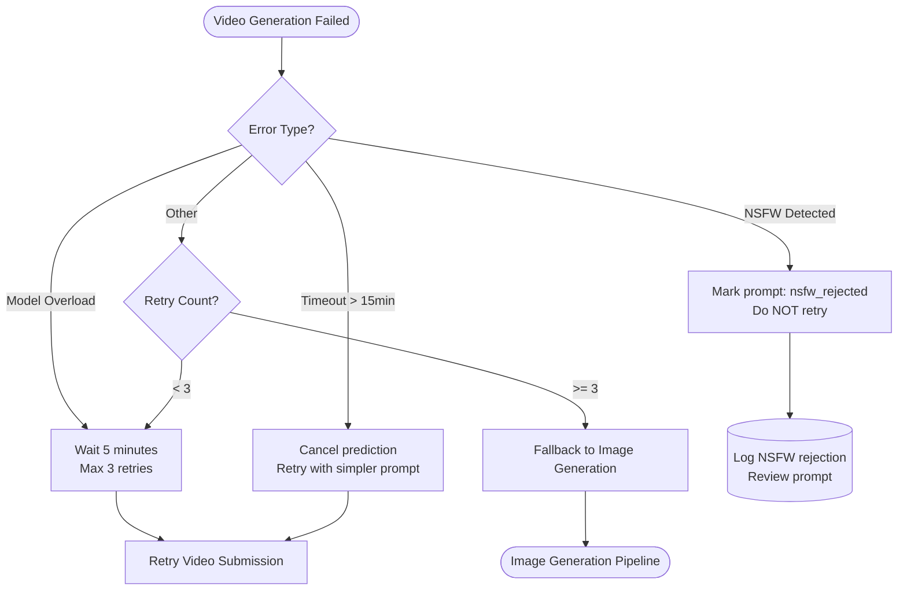

**Implementation:**
- `src/video_generation/vid_gen.py` - Text-to-video generation
- `src/video_generation/google_drive_img2vid.py` - Image-to-video (GPT-4o motion prompts)
- `src/agents/moviepy_reel_creator_agent.py` - Enhancement engine
- `src/agents/music_analysis_agent.py` - Beat detection (librosa)
- `src/agents/music_selector_agent.py` - Mood-based music selection

**Technical Specs:**
- Polling: 30s intervals, 15min max timeout
- Formats: Text-to-video | Image-to-video
- Enhancement: Beat-synced music/transitions/text overlays
- Output: `<video_generation_output>/` (raw) | `<enhanced_video_output>/` (enhanced)
- Platform format: 9:16, 30fps, H.264, AAC 128k, CRF 23

**Error Handling:**
- NSFW: Permanent rejection (no retry)
- Model overload: 5min wait, max 3 retries
- Timeout: Fallback to image generation after 3 attempts

**Current API:** Replicate Kling 2.1

---

## 5. QUALITY ASSESSMENT SYSTEM

### 5.1a Photo Judge Flow

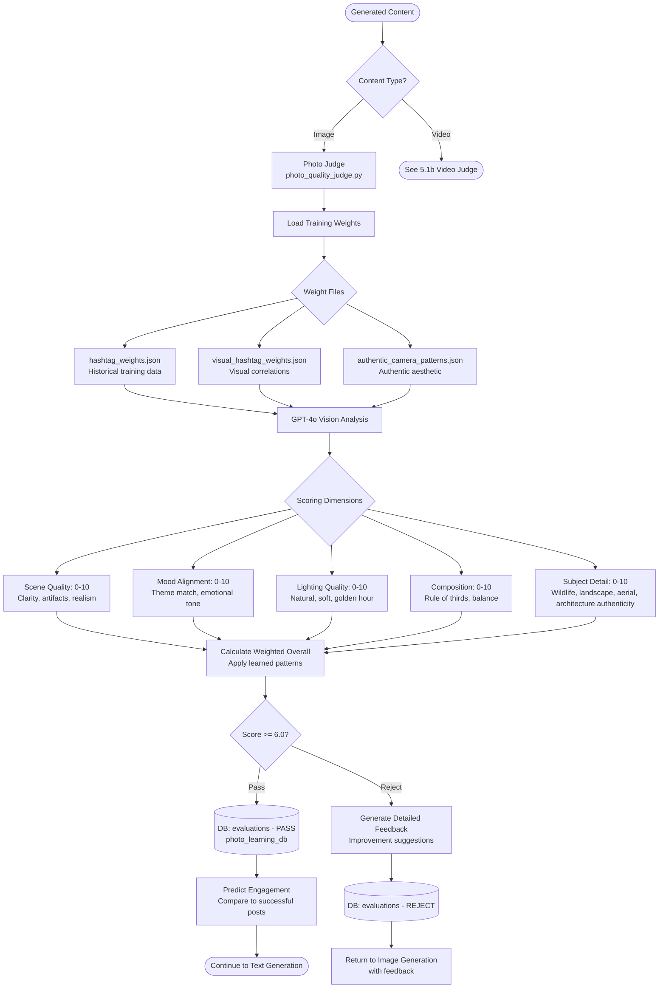

---

### 5.1b Video Judge Flow

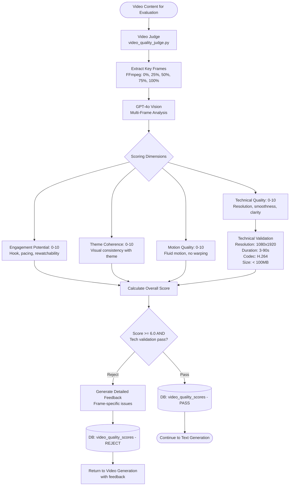

**Implementation:**
- `<evaluation_module>/photo_quality_judge.py` - Image scoring (GPT-4o Vision, 5 dimensions)
- `<evaluation_module>/video_quality_judge.py` - Video scoring (multi-frame analysis)
- `src/video_generation/reel_quality_gate.py` - Technical validation

**Quality Gate 2 Criteria:**
- **Images:** Scene | Mood | Lighting | Composition | Style (weighted by training data)
- **Videos:** Technical | Engagement | Brand | Motion + validation (1080x1920, 3-90s, H.264, <100MB)
- **Threshold:** >= 6.0/10 overall
- **Training Data:** `hashtag_weights.json` | `visual_hashtag_weights.json` | `authentic_camera_patterns.json` | `<evaluation_module>/image_training_data/`

**Pass Rate:** 60-70% first attempt | 85-90% after feedback refinement

---

## 6. TEXT GENERATION SYSTEM

### 6.1a Caption Generation Flow

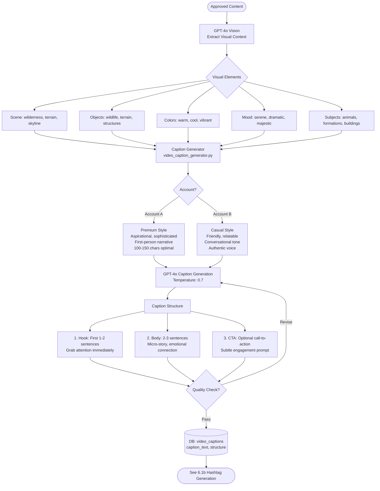

---

### 6.1b Hashtag Generation Flow

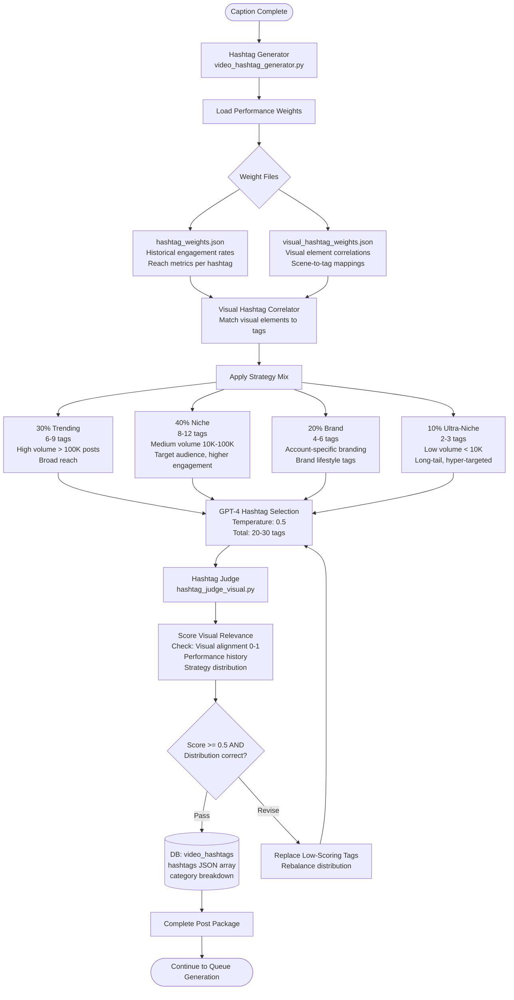

**Implementation:**
- `src/text_content_generation/video_caption_generator.py` - Caption generation (GPT-4o Vision)
- `src/text_content_generation/video_hashtag_generator.py` - Strategic hashtag selection
- `<evaluation_module>/hashtag_judge_visual.py` - Visual relevance scoring
- `<evaluation_module>/caption_judge_vision.py` - Caption quality gate

**Caption Styles:**
- **Account A:** Premium (aspirational, sophisticated, first-person, 100-150 chars)
- **Account B:** Casual (friendly, relatable, conversational, authentic)
- **Structure:** Hook (1-2 sentences) + Body (2-3 sentences) + CTA (optional)

**Hashtag Strategy (20-30 tags):**
- 30% Trending (6-9 tags, >100K posts, broad reach)
- 40% Niche (8-12 tags, 10K-100K posts, target audience)
- 20% Brand (4-6 tags, account-specific)
- 10% Ultra-Niche (2-3 tags, <10K posts, hyper-targeted)
- Weighted by performance data from `hashtag_weights.json` + `visual_hashtag_weights.json`

---

## 7. QUEUE MANAGEMENT & PUBLISHING

### 7.1a Queue Generation Flow

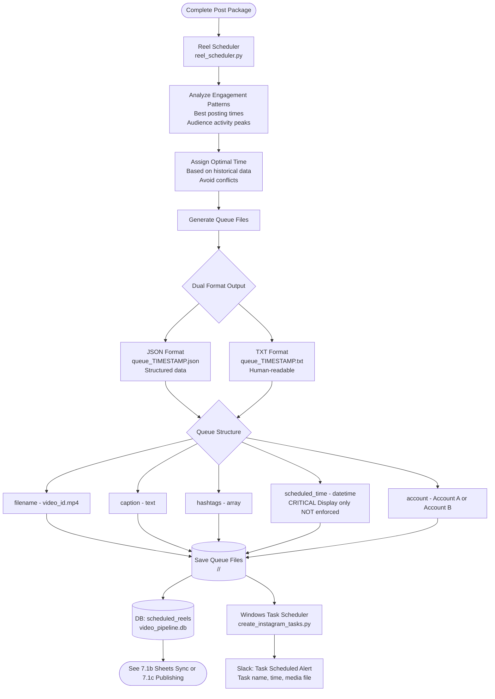

---

### 7.1b Google Sheets Sync (Optional)

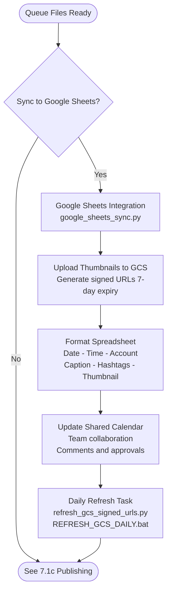

---

### 7.1c Publishing Flow

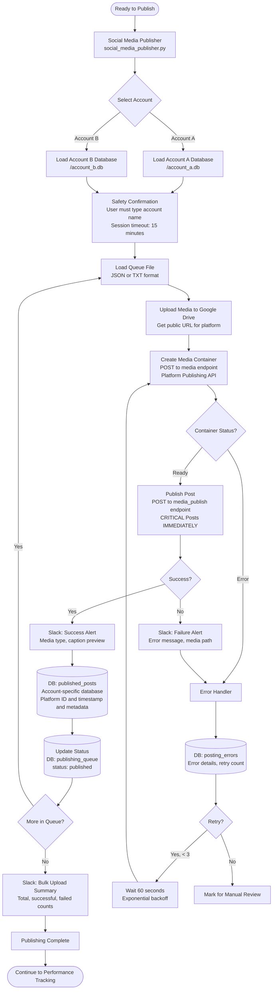

**Implementation:**
- `src/video_generation/reel_scheduler.py` - Queue generation (dual format: JSON + TXT)
- `publisher/social_media_publisher.py` - Publishing engine
- `<sheets_integration_folder>/google_sheets_sync.py` - Optional team calendar sync

**Queue Structure:**
- **Formats:** JSON (programmatic) + TXT (human-readable)
- **Fields:** filename | caption | hashtags[] | scheduled_time | account
- **Location:** `<publishing_queue_folder>/<account>/`

**Safety Features:**
- Account isolation: `<database_folder>/account_a.db` | `<database_folder>/account_b.db`
- Confirmations: Name verification + double confirmation
- Session timeout: 15 minutes
- Rate limiting: Platform API compliance
- Retry: Max 3 attempts, exponential backoff

---

## 8. PERFORMANCE TRACKING & LEARNING LOOP

### 8.1a Metrics Collection

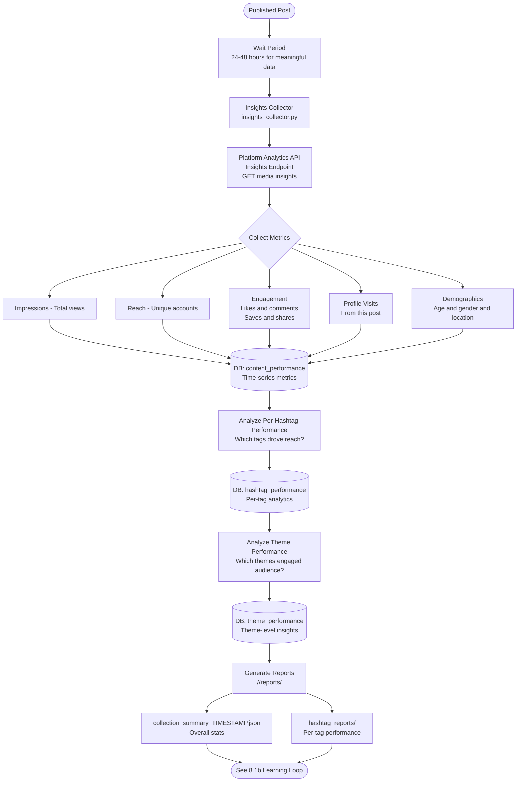

---

### 8.1b Learning Loop

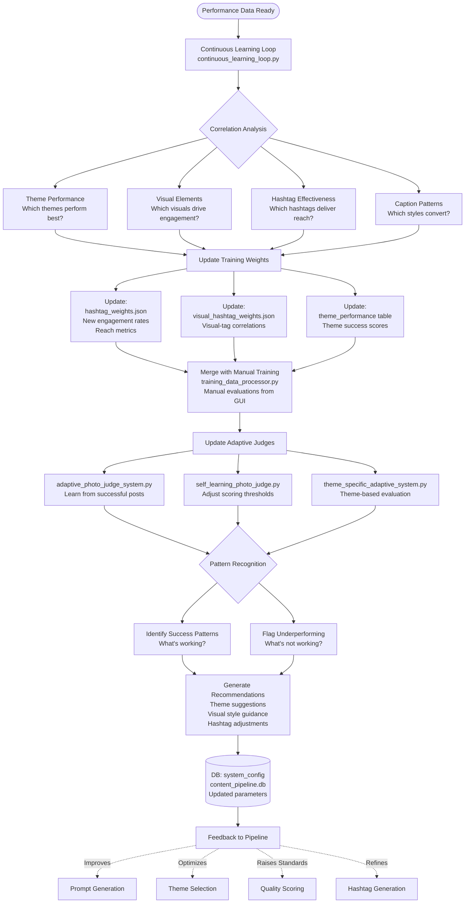

**Implementation:**
- `publisher/insights_collector.py` - Metrics collection (Platform Analytics API, 24-48hr delay)
- `<evaluation_module>/continuous_learning_loop.py` - Correlation analysis → weight updates
- `<evaluation_module>/training_data_processor.py` - Automated + manual data merger
- `<evaluation_module>/adaptive_photo_judge_system.py` - Self-improving quality gates
- `<evaluation_module>/self_learning_photo_judge.py` - Dynamic threshold adjustment
- `<evaluation_module>/theme_specific_adaptive_system.py` - Theme-level optimization

**Metrics Collected:**
- Impressions | Reach | Engagement (likes, comments, saves, shares)
- Profile visits | Demographics | Time-series performance

**Learning Loop:** Performance data → Correlation analysis → Auto-update weights → Improved:
- Prompt generation
- Theme selection
- Quality scoring thresholds
- Hashtag selection strategy

**Training Data:**
- `hashtag_weights.json` - Engagement rates (auto-updated)
- `visual_hashtag_weights.json` - Visual correlations (auto-updated)
- `photo_learning_db` - Quality evaluations
- `<evaluation_module>/image_training_data/` - Manual examples (excellent/good/poor/bad)
- Reports: `<insights_reports_folder>/<account>/reports/`

---

## 9. GOOGLE SHEETS INTEGRATION

### 9.1a Initial Sync Flow

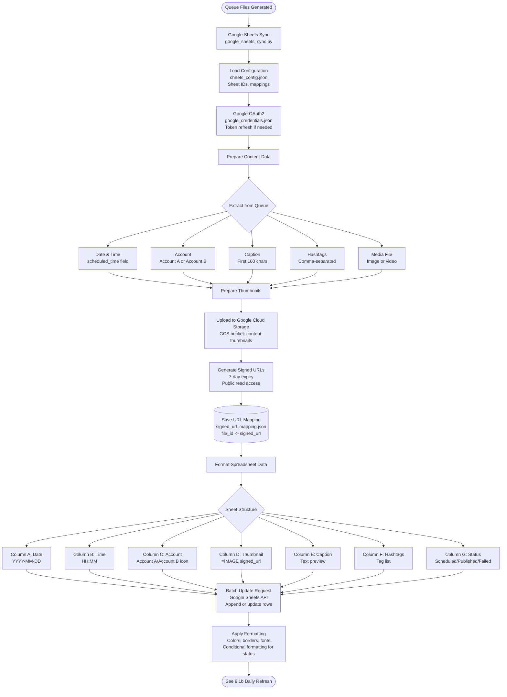

---

### 9.1b Daily Refresh & Collaboration

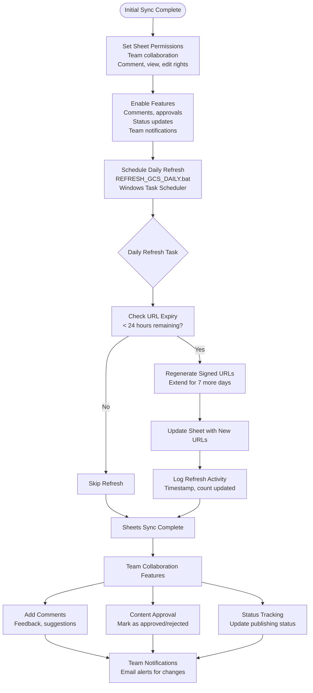

**Implementation:**
- `<sheets_integration_folder>/google_sheets_sync.py` - Queue → Google Sheets sync
- `<sheets_integration_folder>/refresh_gcs_signed_urls.py` - Daily URL regeneration (7-day expiry)
- `<sheets_integration_folder>/REFRESH_GCS_DAILY.bat` - Windows Task Scheduler automation

**Sheet Structure:**
- Date | Time | Account | Thumbnail (GCS signed URL) | Caption | Hashtags | Status

**Configuration:**
- `sheets_config.json` - Sheet IDs, column mappings, GCS bucket
- `calendar_config.json` - Calendar settings
- `signed_url_mapping.json` - File ID → URL mappings
- `carousel_file_mapping.json` - Multi-image tracking

**Use Case:** Team collaboration, visual content calendar, status tracking, approval workflow

---

## 10. SLACK NOTIFICATIONS

### 10.1 Slack Notification Flow

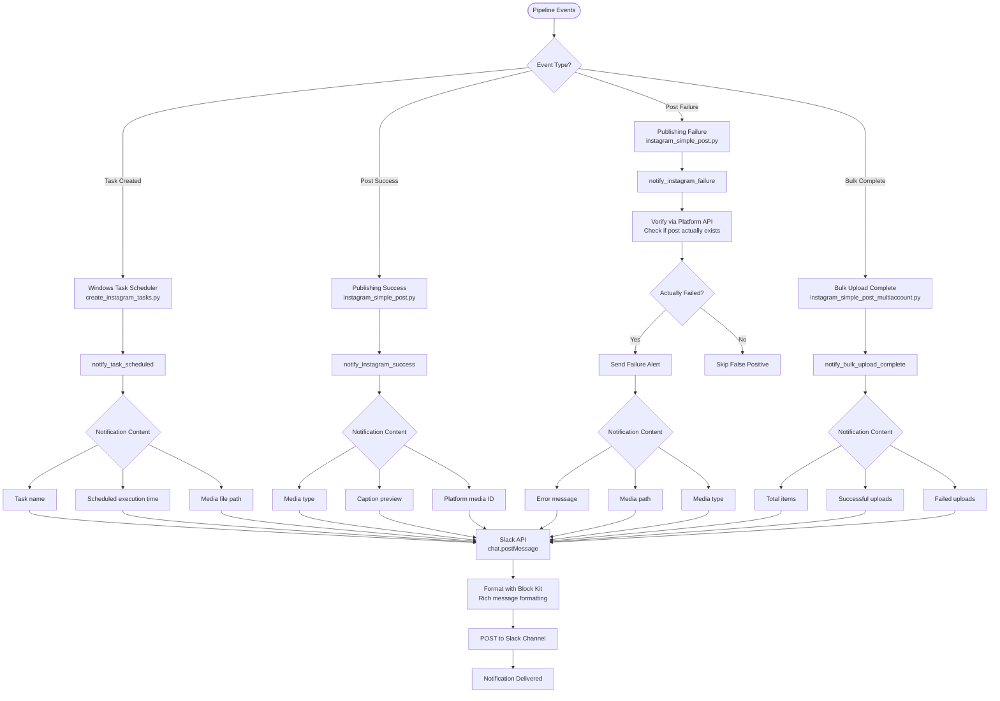

**Implementation:**
- `src/notifications/slack_notifier.py` - Core Slack notification module
- `src/notifications/__init__.py` - Singleton accessor via `get_notifier()`

**Notification Types:**

| Type | Method | Trigger | Content |
|------|--------|---------|---------|
| Task Scheduled | `notify_task_scheduled()` | Windows Task created | Task name, time, media file |
| Post Success | `notify_instagram_success()` | Successful publish | Media type, caption preview |
| Post Failure | `notify_instagram_failure()` | Failed publish | Error message, media path |
| Bulk Complete | `notify_bulk_upload_complete()` | Bulk upload finished | Total, success, failed counts |

**Key Features:**
- Instagram API verification (prevents false failure alerts by checking if post exists)
- Rich formatting via Slack Block Kit
- Dual transport support (slack_sdk library with requests fallback)

**Integration Points:**
1. `instagram_publisher/create_instagram_tasks.py` - Task scheduling alerts
2. `instagram_publisher/instagram_simple_post.py` - Individual post success/failure
3. `instagram_publisher/instagram_simple_post_multiaccount.py` - Bulk upload summaries
4. `instagram_publisher/run_single_post.py` - Scheduled post execution alerts

---

## 11. API & TOOL REFERENCE

### 11.1 Content Generation APIs

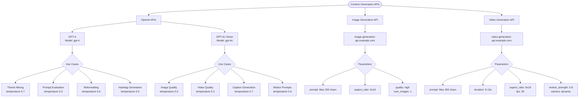

---

### 11.2 Publishing & Storage APIs

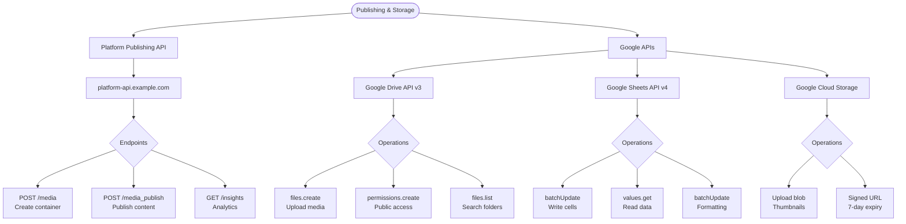

---

### 11.3 Current Implementation

**Image Generation:** Replicate FLUX.1 Krea [dev]

**Video Generation:** Replicate Kling 2.1

**Python Stack:**
`openai` | `replicate` | `requests` | `google-api-python-client` | `google-auth` | `moviepy` | `librosa` | `Pillow` | `ffmpeg-python` | `slack_sdk`

---

### 11.4 Rate Limits & Best Practices

| API | Rate Limit | Strategy |
|-----|------------|----------|
| OpenAI GPT-4 | 10K RPM (tier-based) | Parse rate limit headers, exponential backoff |
| OpenAI GPT-4o | 30K RPM (tier-based) | Parse rate limit headers, exponential backoff |
| Image Generation | 100-1000 req/day (provider-dependent) | Queue for next day if exhausted |
| Video Generation | Pay-per-use (provider-dependent) | No strict limits, cost management |
| Platform Publishing | 200-500 calls/hour per user | Respect cooldowns, session timeouts |
| Google Drive | 10M requests/day | Batch operations where possible |
| Google Sheets | 500 requests/100 seconds | Use batchUpdate for multi-cell writes |

---

## 12. DATABASE SCHEMAS

### 12.1 Content Generation Databases

`content_pipeline.db` - Core prompt and image generation workflow

```mermaid
graph TB
    PipelineDB[(content_pipeline.db)]

    PipelineDB --> Prompts[generated_prompts<br/>prompt_id PK<br/>theme_name<br/>prompt_text<br/>keywords_used JSON<br/>mandatory_elements JSON<br/>status, created_at]

    PipelineDB --> Evaluations[prompt_evaluations<br/>evaluation_id PK<br/>prompt_id FK<br/>theme_alignment_score<br/>keyword_coverage_score<br/>coherence_score<br/>overall_score<br/>decision, feedback]

    PipelineDB --> Reformatted[reformatted_prompts<br/>reformatted_id PK<br/>original_prompt_id FK<br/>reformatted_text<br/>target_api<br/>technical_parameters JSON<br/>character_count]

    PipelineDB --> Images[generated_images<br/>image_id PK<br/>prompt_id FK<br/>file_path, resolution<br/>file_size_bytes<br/>gdrive_url, gdrive_file_id<br/>status, created_at]

    PipelineDB --> Config[system_config<br/>config_key PK<br/>config_value JSON<br/>Auto-updated by learning loop]
```

---

### 12.2 Video & Enhancement Databases

`video_pipeline.db` - Video generation, captions, hashtags, and music integration

```mermaid
graph TB
    VideoDB[(video_pipeline.db)]

    VideoDB --> Videos[videos<br/>video_id PK<br/>prompt_id FK<br/>file_path, duration_seconds<br/>resolution, fps, codec<br/>video_job_id<br/>has_music, music_id<br/>has_text_overlays<br/>enhanced BOOLEAN]

    VideoDB --> Captions[video_captions<br/>caption_id PK<br/>video_id FK<br/>caption_text<br/>character_count<br/>hook, body, cta<br/>style, account<br/>quality_score]

    VideoDB --> Hashtags[video_hashtags<br/>hashtag_set_id PK<br/>video_id FK<br/>hashtags JSON array<br/>trending_hashtags JSON<br/>niche_hashtags JSON<br/>brand_hashtags JSON<br/>visual_relevance_scores JSON<br/>strategy_distribution JSON]

    VideoDB --> Music[music_metadata<br/>music_id PK<br/>video_id FK<br/>music_file_path<br/>bpm INTEGER<br/>beat_timestamps JSON<br/>energy_levels JSON<br/>optimal_start/end_time<br/>mood TEXT]

    VideoDB --> Quality[video_quality_scores<br/>score_id PK<br/>video_id FK<br/>technical_quality<br/>engagement_potential<br/>theme_coherence<br/>motion_quality<br/>overall_score<br/>passes_quality_gate<br/>rejection_reasons JSON]
```

---

### 12.3 Publishing & Performance Databases

`account_a.db` | `account_b.db` - Account-specific publishing, errors, and analytics

```mermaid
graph TB
    AccountDB[(Account Databases)]

    AccountDB --> Posts[published_posts<br/>post_id PK<br/>platform_media_id<br/>content_type<br/>caption, hashtags JSON<br/>posted_at<br/>gdrive_url<br/>queue_file_source]

    AccountDB --> Queue[publishing_queue<br/>queue_id PK<br/>content_id<br/>scheduled_time<br/>status<br/>retry_count<br/>last_attempt_at<br/>Tracks publish attempts]

    AccountDB --> Errors[posting_errors<br/>error_id PK<br/>queue_id FK<br/>error_type<br/>error_message<br/>error_details JSON<br/>occurred_at<br/>resolved BOOLEAN]

    AccountDB --> Performance[content_performance<br/>perf_id PK<br/>post_id FK<br/>impressions, reach<br/>likes, comments<br/>saves, shares<br/>profile_visits<br/>collected_at<br/>Time-series metrics]

    AccountDB --> HashtagPerf[hashtag_performance<br/>hashtag_perf_id PK<br/>post_id FK<br/>hashtag TEXT<br/>engagement_rate<br/>reach_contribution<br/>category<br/>Per-tag analytics]

    AccountDB --> ThemePerf[theme_performance<br/>theme_perf_id PK<br/>theme_name<br/>post_count<br/>avg_engagement_rate<br/>avg_reach<br/>success_score<br/>Theme-level insights]
```

---

### 12.4 Learning & Training Databases

`photo_learning_db` - Quality evaluations and manual training data

```mermaid
graph TB
    LearningDB[(photo_learning_db)]

    LearningDB --> Evals[evaluations<br/>evaluation_id PK<br/>content_id FK<br/>content_type<br/>scene_quality<br/>mood_alignment<br/>lighting_quality<br/>composition<br/>subject_detail<br/>overall_score<br/>visual_elements JSON<br/>strengths JSON<br/>weaknesses JSON<br/>predicted_engagement<br/>passes_quality_gate<br/>decision]

    LearningDB --> Training[training_data<br/>training_id PK<br/>content_id<br/>manual_score<br/>ai_score<br/>feedback_notes<br/>category<br/>excellent/good/poor/bad<br/>Manual quality assessments]
```

**Database Architecture:**
The pipeline uses 4 database types: (1) `content_pipeline.db` for prompts and images, (2) `video_pipeline.db` for video workflow, (3) `photo_learning_db` for training/evaluations, (4) Account-specific databases for publishing and analytics. Complete data separation between accounts. SQLite for portability.

**Key Relationships:**
- `prompts → reformatted_prompts → content → captions/hashtags → queue → published posts → performance`
- `videos → music_metadata` (1-to-1 if enhanced)
- `videos → video_quality_scores` (1-to-1 evaluation)
- `content` → `evaluations` (1:many, multi-judge scoring)
- `posts` → `content_performance` (1:many, time-series)
- `posts` → `hashtag_performance` (1:many, per-tag metrics)

**Database Files:**
- `<database_folder>/content_pipeline.db` - Main pipeline
- `<database_folder>/video_pipeline.db` - Video workflow
- `<database_folder>/photo_learning_db` - Training/evaluation data
- `<database_folder>/account_a.db` - Account A (premium)
- `<database_folder>/account_b.db` - Account B (standard)

**Management:**
- `src/database/database_connection.py` - Connection manager
- `src/database/migrate_add_metadata_column.py` - Migration: metadata
- `src/database/migrate_add_music_metadata.py` - Migration: music support

---

## 13. ERROR HANDLING & RETRY LOGIC

### 13.1 Error Classification (Overview)

```mermaid
graph TB
    ErrorStart([Error Encountered])

    ErrorStart --> ClassifyError{Error Type?}

    ClassifyError -->|API Failure| APIError[API Error Handler<br/>See Section 13.2]
    ClassifyError -->|Publishing| PublishError[Platform Error Handler<br/>See Section 13.3]
    ClassifyError -->|Infrastructure| InfraError[Infrastructure Error Handler<br/>See Section 13.4]
    ClassifyError -->|Content Rejection| ContentError[Content Error Handler<br/>See Section 13.5]

    APIError --> RetryLogic[Retry Logic]
    PublishError --> RetryLogic
    InfraError --> RetryLogic
    ContentError --> RetryLogic

    RetryLogic --> CheckRetryCount{Retry Count?}
    CheckRetryCount -->|< Max Retries| PerformRetry[Perform Retry<br/>Exponential backoff]
    CheckRetryCount -->|>= Max Retries| LogFailure[(Log to posting_errors<br/>Manual review)]

    PerformRetry --> Success{Success?}
    Success -->|Yes| Continue[Continue Pipeline]
    Success -->|No| ErrorStart
```

---

### 13.2 API Error Handling

```mermaid
graph TB
    APIStart([API Error])

    APIStart --> APIType{API Type?}

    APIType -->|OpenAI| OpenAIHandler[OpenAI Handler]
    APIType -->|Image Gen| ImageHandler[Image Gen Handler]
    APIType -->|Video Gen| VideoHandler[Video Gen Handler]

    OpenAIHandler --> OpenAIErrors{Error?}
    OpenAIErrors -->|429 Rate Limit| RateLimit[Parse reset time<br/>Wait exact duration<br/>Retry]
    OpenAIErrors -->|401 Unauthorized| InvalidKey[Verify API key<br/>Alert user<br/>Halt]
    OpenAIErrors -->|400 Bad Request| LogInvalid[Log request<br/>Skip item<br/>Continue]
    OpenAIErrors -->|500 Server| Backoff[Exponential backoff<br/>2s, 4s, 8s<br/>Max 3 retries]

    ImageHandler --> ImageErrors{Error?}
    ImageErrors -->|429 Rate Limit| QuotaWait[Queue for quota reset<br/>Tomorrow retry]
    ImageErrors -->|400 Invalid Prompt| RefinePrompt[Refine prompt<br/>Remove issues<br/>Retry once]
    ImageErrors -->|402 Payment| QuotaAlert[Alert: Quota exhausted<br/>Pause generation]
    ImageErrors -->|Generation Failed| RetryGen[Retry 3x<br/>Then mark failed]

    VideoHandler --> VideoErrors{Error?}
    VideoErrors -->|NSFW Detected| NSFWMark[Mark nsfw_rejected<br/>No retry<br/>Log for review]
    VideoErrors -->|Model Overloaded| ModelWait[Wait 5min<br/>Retry 3x<br/>Queue if persist]
    VideoErrors -->|Timeout 15min| CancelJob[Cancel job<br/>Simplify prompt<br/>Fallback to image]
    VideoErrors -->|Failed| CheckMsg[Check error type<br/>Retry if transient]
```

---

### 13.3 Platform Publishing Errors

```mermaid
graph TB
    PubStart([Publishing Error])

    PubStart --> PubType{Error Source?}

    PubType -->|Platform API| PlatformHandler[Platform Handler]
    PubType -->|Google API| GoogleHandler[Google Handler]

    PlatformHandler --> PlatformErrors{Error?}
    PlatformErrors -->|401 Access Token| RefreshToken[OAuth2 token refresh<br/>Retry once]
    PlatformErrors -->|429 Rate Limit| RateWait[Wait 1 hour<br/>Reduce frequency<br/>Review quality]
    PlatformErrors -->|400 Invalid Params| ValidateMedia[Validate URL<br/>Check caption length<br/>Fix and retry]
    PlatformErrors -->|403 Permissions| CheckPerms[Verify permissions<br/>content_publish<br/>Alert if missing]

    GoogleHandler --> GoogleErrors{Error?}
    GoogleErrors -->|401 Auth| RefreshGoogle[Refresh OAuth2<br/>Re-auth if expired<br/>Retry]
    GoogleErrors -->|403 Quota| QuotaReset[Wait quota reset<br/>Queue operations]
    GoogleErrors -->|404 Not Found| VerifyIDs[Verify file/sheet IDs<br/>Check config<br/>Alert user]
    GoogleErrors -->|500 Server| RetryGoogle[Backoff retry<br/>2s, 4s, 8s<br/>Max 3 attempts]
```

---

### 13.4 Infrastructure Errors

```mermaid
graph TB
    InfraStart([Infrastructure Error])

    InfraStart --> InfraType{Error Type?}

    InfraType -->|Network| NetworkHandler[Network Handler]
    InfraType -->|File Operation| FileHandler[File Handler]
    InfraType -->|Database| DBHandler[Database Handler]

    NetworkHandler --> NetCheck[Verify connection<br/>Ping test]
    NetCheck -->|Connected| NetRetry[Retry with backoff<br/>Max 3 attempts]
    NetCheck -->|Disconnected| NetWait[Wait for connection<br/>Alert user<br/>Pause]

    FileHandler --> FileErrors{Error?}
    FileErrors -->|Not Found| CheckPath[Verify path<br/>Log missing file]
    FileErrors -->|Permission Denied| CheckFilePerms[Check permissions<br/>UAC issues<br/>Run as admin]
    FileErrors -->|Disk Full| DiskAlert[Alert: Disk full<br/>Clean temp<br/>Halt]
    FileErrors -->|Corrupted| DetectCorrupt[Check file size < 1KB<br/>Re-generate content]

    DBHandler --> DBErrors{Error?}
    DBErrors -->|Locked| WaitUnlock[Wait unlock<br/>SQLite 5s timeout<br/>Retry transaction]
    DBErrors -->|Schema Error| RunMigrations[Run migrations<br/>migrate_*.py<br/>Verify version]
    DBErrors -->|Constraint Violation| LogConstraint[Log details<br/>Skip duplicate<br/>Continue]
    DBErrors -->|Corrupted| RestoreBackup[Attempt restore<br/>Check .backup files]
```

---

### 13.5 Content & Retry Strategy

```mermaid
graph TB
    ContentStart([Content Rejection])

    ContentStart --> ContentType{Rejection Reason?}

    ContentType -->|Quality Low| QualityFeedback[Return to generation<br/>AI feedback<br/>Max 3 attempts]
    ContentType -->|NSFW Content| NSFWSkip[Skip content<br/>Log detection<br/>No retry<br/>Review prompt]
    ContentType -->|Technical Invalid| TechFix[Fix technical<br/>Resolution/codec/format<br/>Retry once]

    QualityFeedback --> RetryDecision[Retry Decision]
    NSFWSkip --> Continue[Continue Pipeline]
    TechFix --> RetryDecision

    RetryDecision --> RetryCount{Attempt Count?}
    RetryCount -->|< 3| ApplyBackoff[Apply exponential backoff<br/>2s → 4s → 8s<br/>Retry operation]
    RetryCount -->|>= 3| LogError[(Log to posting_errors<br/>Error type + details<br/>Manual review queue)]

    ApplyBackoff --> Success{Success?}
    Success -->|Yes| Continue
    Success -->|No| ContentStart

    LogError --> ManualReview[Manual Review<br/>Admin intervention]
```

**Error Classification:**
- **API Errors:** OpenAI | Image Gen | Video Gen | Platform | Google (rate limits, quotas, token refresh)
- **Network:** Connection verification + exponential backoff (2s, 4s, 8s, max 3 attempts)
- **File Operations:** Missing files, permissions, disk space, corruption (< 1KB detection)
- **Database:** SQLite locks, migrations, constraint violations
- **Authentication:** OAuth2 token refresh
- **Content Rejection:** Return to generation with AI feedback (max 3 attempts)

**Retry Strategies:**
- Exponential backoff: 2s → 4s → 8s (transient errors)
- Rate limit: Parse reset time, wait exact duration
- Quota exhausted: Queue for next reset (daily/hourly)
- NSFW: No retry (permanent), log for refinement
- Network: Verify connection, retry with backoff, halt if persistent
- Max retries: 3 attempts → `posting_errors` table for manual review

**Error Logging:**
- Database: `posting_errors` table (error_type, message, details JSON, retry_count, resolved)
- Files: Component-specific logs in `logs/` directory
- User Alerts: Console output for critical errors requiring intervention

**Manual Review Queue:** Failed items after max retries go to manual review queue. Admin can inspect errors, fix issues, and retry manually via publisher menu.

---

