> **Portfolio Note:** This was a group project completed using Agile methodology. My contributions included the footfall data cleaning and the machine learning components.

# 🎨 Museum Project: Collections and KPI Trends


---

## 📑 Table of Contents
1. [Project Overview](#project-overview)
2. [Research Questions](#research-questions)
3. [Datasets](#datasets)
4. [Repository Structure](#repository-structure)
5. [Project Workflow](#project-workflow)
6. [Methods Summary](#methods-summary)
7. [Results Summary](#results-summary)
8. [Setup & Requirements](#setup--requirements)
9. [How to Run the Project](#how-to-run-the-project)
10. [Project Timeline](#project-timeline)
11. [Contributors](#contributors)
    
---

<a id="project-overview"></a>
## 🧭 Project Overview
<details>
<summary><strong>Click to expand</strong></summary>

This project examines how museum collections and visitor behaviour intersect across the UK national museum sector. Using sculpture records from the V&A and the British Museum, alongside DCMS visitor footfall and KPI data, the work explores cultural representation, geographic patterns and long term visitor trends.

The analysis combines data cleaning, integration, visualisation and predictive modelling to support clearer insight into museum audiences and the cultural material they encounter.

</details>

---

<a id="research-questions"></a>
## 🎯 Research Questions
<details>
<summary><strong>Click to expand</strong></summary>

To guide the analysis and ensure a focused approach across the collections and visitor data, the project addressed the following research questions:
1. How are cultures, regions, materials and techniques represented across sculpture collections, and how have these changed over time
2. How have visitor numbers to national museums changed over the past two decades
3. What relationship can be observed between visitor attendance and museum income
4. Can future museum footfall be forecast using time series models

</details>

---

<a id="datasets"></a>
## 📚 Datasets
<details>
<summary><strong>Click to expand</strong></summary>

**V&A Collections API**  
Structured API queries retrieving sculpture objects with production place, date, materials and techniques.  
https://www.vam.ac.uk/collections

**British Museum Collections CSV**  
Downloaded sculpture object records requiring substantial cleaning due to non standardised fields.  
https://www.britishmuseum.org/collection/

**DCMS National Museums Footfall**  
Monthly totals (2004–2025), used to explore seasonality and long term public engagement.  
https://www.gov.uk/government/statistical-data-sets/museums-and-galleries-monthly-visits

**DCMS National Museums KPIs**  
Annual indicators including income and attendance, aligned with visitor trends.  
https://www.gov.uk/government/statistics/dcms-sponsored-museums-and-galleries-annual-performance-indicators-202324

**Tate Collections (GitHub)**  
Publicly accessible object metadata used for comparative analysis.  
https://github.com/tategallery/collection

**Tate Temporary Exhibitions (Figshare)**  
Dataset documenting exhibition duration and medium.  
https://figshare.com/articles/dataset/Temporary_Exhibitions_at_Tate_Modern_-_2008_to_2016/5766570

</details>

---

<a id="repository-structure"></a>
## 📁 Repository Structure
<details>
<summary><strong>Click to expand</strong></summary>

The project repository is organised to separate data cleaning, exploratory work, modelling and final outputs, ensuring clarity, reproducibility and ease of navigation.

```mermaid
flowchart TB

    A([📁 MUSEUM_PROJECT])

    subgraph COL[📂 collections]
        C1([📂 data])
        C2([📂 notebooks])
        C3([📂 visualisations])
        C4([📂 api])
    end

    subgraph KPI[📂 kpis]
        K1([📂 data])
        K2([📂 notebooks])
        K3([📂 visualisations])
    end

    subgraph ML[📂 machine_learning]
        M1([📂 data])
        M2([📂 notebooks])
        M3([📂 visualisations])
    end

    A --> COL
    A --> KPI
    A --> ML
    A --> IG([📝 .gitignore])
    A --> README([📝 README.md])
    A --> REQ([📝 requirements.txt])
    A --> NOTE([📝 notebook_reference.md])
```


</details>

---

<a id="project-workflow"></a>
## 🔄 Project Workflow
<details>
<summary><strong>Click to expand</strong></summary>

The project workflow combined a planned sequence of tasks with iterative refinement, progressing from data collection and cleaning to integration, analysis, visualisation and modelling.


</details>

---

<a id="methods-summary"></a>
## 🛠️ Methods Summary
<details>
<summary><strong>Click to expand</strong></summary>

The following summary outlines the key methods applied in cleaning, standardising and integrating the datasets, and the analytical and modelling techniques used to produce the final insights.

### 🏺 Collections Strand  
- Standardised dates into start, end and midpoint years  
- Normalised production place names and mapped to modern countries  
- Cleaned materials and techniques fields  
- Integrated datasets for combined visualisation  

### 👥 Footfall Strand  
- Reshaped monthly DCMS data into a continuous time series  
- Analysed seasonality and long term patterns  
- Tested regression, XGBoost and ARIMA models  

### 📊 KPI Strand  
- Cleaned annual income and attendance data  
- Standardised museum names and year structures  
- Corrected malformed financial values  
- Merged multiple tables into a single analysis dataset  

</details>

---

<a id="results-summary"></a>
## 📈 Results Summary
<details>
<summary><strong>Click to expand</strong></summary>

### 🏺 Collections Findings
- Eurocentric distribution dominated by Italy, the UK, Greece and Egypt  
- BM shows wider global coverage; V&A more European  
- Distinct institutional collecting patterns revealed  

### 📊 KPI Insights
- Income and footfall both peak around 2014–15  
- Income declines slightly afterwards despite steady attendance  
- Strong recovery by 2023–24  

### 👥 Footfall Trends
- Steady growth 2004–2019, sharp decline during pandemic  
- Some museums now exceed pre-pandemic attendance  
- Strong seasonal variation (summer peaks, winter lows)  

### 🤖 Machine Learning Outcomes
- XGBoost performed best in early tests  
- Produces reasonable overall volume predictions  
- Volatility remains due to structural breaks  

### 🧱 Materials & Techniques Timeline
- Long lived techniques (carving, casting) appear across millennia  
- Terracotta, marble and bronze persist through history  
- Later periods show denser, better documented activity  

</details>

---

<a id="setup--requirements"></a>
## ⚙️ Setup & Requirements 
<details>
<summary><strong>Click to expand</strong></summary>

Install dependencies:

```
pip install -r requirements.txt
jupyter notebook
```

Required libraries:

- python  
- pandas  
- numpy  
- matplotlib  
- seaborn  
- scikit learn  
- statsmodels  
- xgboost  
- jupyter notebook  

</details>

---

<a id="how-to-run-the-project"></a>
## ▶️ How to Run the Project
<details>
<summary><strong>Click to expand</strong></summary>

A full running order of all notebooks used in the project can be found in notebook_reference.md.

1. Clone the repository  
2. Install dependencies listed in requirements.txt  
3. The general flow of the analysis is from `collections` to `machine_learning` and then to `kpis`  
4. Notebooks are designed to be run independently and are linked to source files already saved in the repository `data` folders  
5. Example visualisations are already saved in the `visualisation` folders, but it is also possible to generate them directly by running the notebooks  

</details>

---

<a id="project-timeline"></a>
## 🗓️ Project Timeline
<details>
<summary><strong>Click to expand</strong></summary>


</details>

---

<a id="contributors"></a>
## 👥 Contributors
<details>
<summary><strong>Click to expand</strong></summary>
 
**Angie**

**Diana**  
https://github.com/dianaasihene

**Jenny**  
https://github.com/jeenny

**Jennifer**  
https://github.com/jennifer-hunter

**Jo-Ann**  
https://github.com/Jo-bin

**Nicky**  
https://github.com/nickscross

</details>
